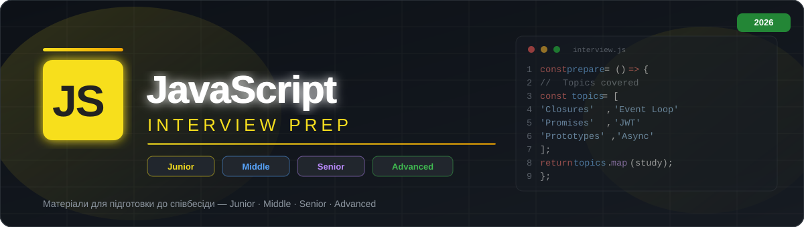

# JavaScript Interview Prep

Структурована база знань для підготовки до технічних співбесід на позиції Front-End / JavaScript Engineer.

---

## Зміст

| Рівень | Файл | Теми |
|---|---|---|
| 🟡 Junior / Basic | [Junior-Topics.md](Junior-Topics.md) | Типи, hoisting, scope, DOM |
| 🔵 Middle | [Middle-Topics.md](Middle-Topics.md) | Async/await, Event Loop, Closures, Prototypes |
| 🟣 Senior | [Senior-Topics.md](Senior-Topics.md) | Архітектура, Performance, Design Patterns |
| 🔴 Advanced | [Advanced-Topics.md](Advanced-Topics.md) | JWT, Auth, WebSockets, Security, Micro-frontends |

---

## Як користуватися

1. Обирай потрібний рівень зі списку вище
2. Читай питання та відповіді
3. Для самоперевірки — закрий відповідь і спробуй відповісти самостійно

---

> Актуалізовано: 2026-07-27
